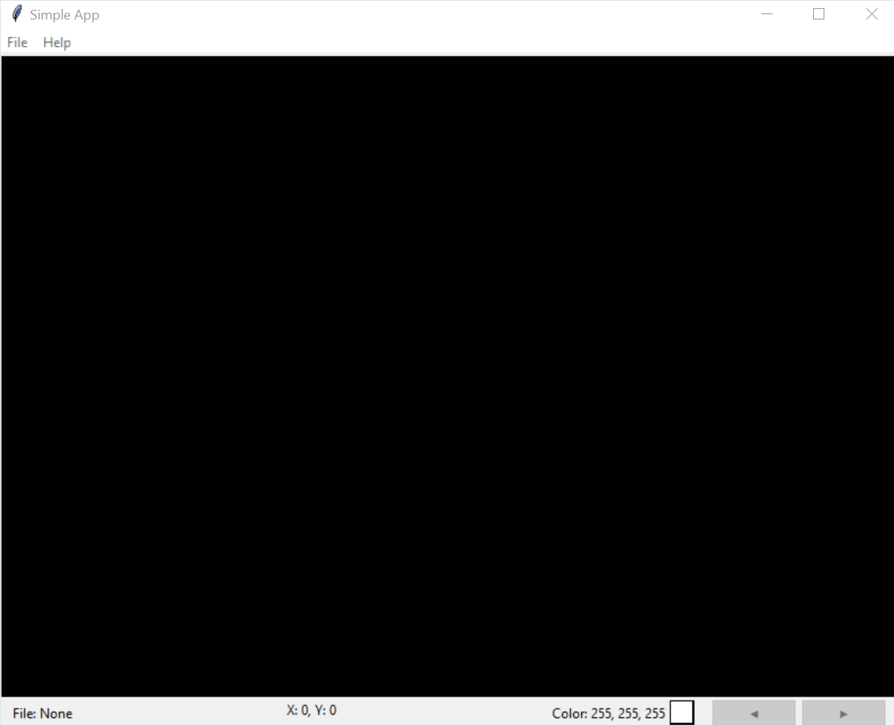

# Py_g_debug and Py_cluster
Py_g_debug is a simple application that enables visual debugging, which is useful when working with images.
In addition, the project includes a basic clustering algorithm(Py_cluster) as an example of how to use it.

## Demo

**Example of debugging:**


**Example of inspecting image:**


## Installation

1. **Clone the repo**  
   ```bash
   git clone https://github.com/Rejman333/PythonLab.git
2. **Create a virtual environment (optional but recommended)**
    ```bash
    python3 -m venv venv
    source venv/bin/activate
   ```
3. **Install dependencies**
    Make sure you have a *requirements.txt* file in the project root with the following content:
    ```
    numpy~=2.2.3
    matplotlib~=3.10.1
    pillow~=11.1.0
   ```
   Then install:
    ```bash
    pip install -r requirements.txt
    ```
4. **Usage** 
The py_cluster tool is invoked via the command line. It accepts the following arguments:
```
usage: clustering_example.py [-h] [-t THRESHOLD] [-g GRAY] [-d] filename
```

* filename (positional)
  * Path to the input image file.
* -t, --threshold (optional)
  * Threshold value for binarization (0–255).
  * Default: 127.
* -g, --gray (optional)
  * Grayscale mode, specified as an integer (0–3) or one of: r, g, b, m.
    * 0/r: Red channel
    * 1/g: Green channel
    * 2/b: Blue channel
    * 3/m: Mean of all channels
  * Default: m (mean).
* -d, --debug (optional)
  * Enable debug mode to display intermediate processing steps.

**Examples:**
```bash
# Run with default threshold and grayscale mean:
python clustering_example.py input.jpg

# Run with a threshold of 200 and red-channel grayscale:
python clustering_example.py -t 200 -g r input.jpg

# Run in debug mode to inspect intermediate steps:
python clustering_example.py -d input.jpg
```

**Usage of py_g_debug**

```Bash
 python .\py_g_debug.py
 ```
#### File Menu Options
* Open 
  * Open an image file (e.g. .png, .jpg) from disk.
* Import Bounding Boxes
  * Load a CSV or JSON file containing bounding-box annotations in any of the supported formats.
* Monitor Folder
  * Select a folder to watch. New images that appear in this folder will be loaded automatically, allowing continuous real-time preview.
* Exit
  * Quit the application.

#### Mouse & Keyboard Controls
* Left Mouse Button (Drag)
  * Click and drag to pan the image within the window.
* Ctrl + Mouse Scroll
  * Scroll up/down (while holding Control) to zoom in and out.
* Esc
  * Reset the image zoom and pan back to the default view.


